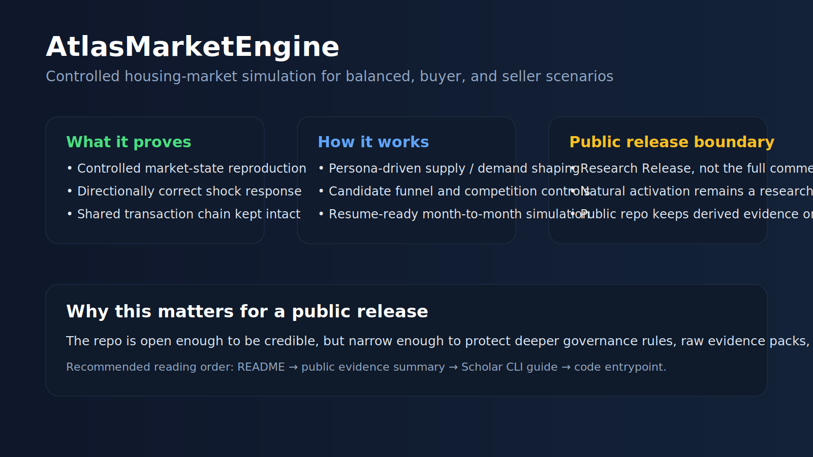
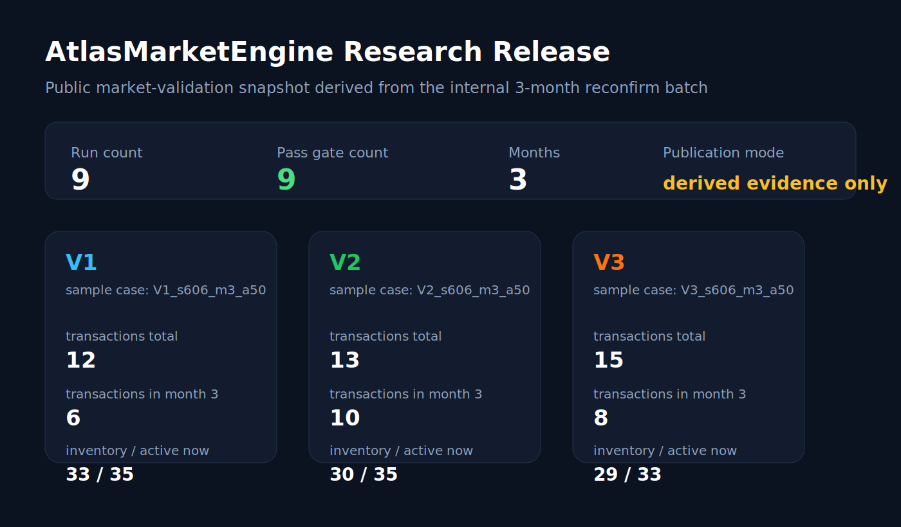
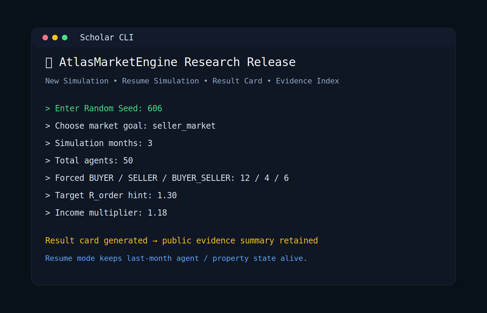

# AtlasMarketEngine

**A public Research Release for controlled housing-market simulation**

AtlasMarketEngine is a research-grade market simulation engine designed to reproduce three interpretable market states under a shared transaction chain:

- balanced market
- buyer market
- seller market

It also supports directional shock testing through a human-friendly CLI with resumable month-to-month state.

---

## 中文简介

AtlasMarketEngine 是一个面向公开交流的房地产市场推演研究版系统。

它当前重点证明的，不是“自然激活已经完全研究透了”，而是另一件更硬的事：

**在共享交易主链下，系统已经具备稳定构造三类市场状态的能力：**

- 平衡市场
- 买方市场
- 卖方市场

并且，它已经能够在外生变量注入后，给出方向合理、可解释的响应。

### 这次公开版保留了什么

- 可运行的核心代码
- 真人友好的 Scholar CLI 入口
- 公开版派生证据摘要
- 首页展示图、一页卖点图、CLI 展示图

### 这次公开版没有保留什么

- 更完整的内部原始证据库
- 更深的治理参数包
- 更成熟的自然激活研究线材料
- 商业化场景和行业适配层

换句话说，这不是完整商业版，也不是最终产品版，而是：

**一个可运行、可讲清楚、可建立可信度的 Research Release。**

### 如果你只有 5 分钟

建议按这个顺序看：

1. [公开证据摘要](./evidence/market_validation_summary_public.md)
2. [发布目录索引](./docs/发布目录索引.md)
3. [Scholar CLI 复现实验说明](./docs/Scholar_CLI_复现实验说明_20260412.md)
4. [CLI 主入口](./real_estate_demo_v2_1.py)

### 公开版已经能看到哪些结果趋势

基于公开版保留的派生证据，我们现在至少可以直接说清两类趋势：

1. 成交量走势
   - 三组样本在月 1 都没有最终成交，真正的成交放量是从月 2 开始展开的。
   - `V3` 在月 2 放量最强，说明卖方环境的需求压力更早转成真实成交。
   - `V2` 的成交高点更偏向月 3，说明买方环境的兑现节奏更慢。

2. A/B 分区成交单价走势
   - `A` 区成交均价始终显著高于 `B` 区。
   - `V3` 中 `B` 区在月 2、月 3 都有成交，说明卖方环境下需求开始向外围区外溢。
   - `V2` 中 `B` 区成交更少，说明买方环境里买家更容易停留在高匹配度候选房，而不是快速外溢。

对应公开证据见：

- [公开证据摘要](./evidence/market_validation_summary_public.md)

### 为什么当前公开版以 3 个月短测为主

当前公开版没有把“长周期自然激活市场演化”当作主卖点，原因不是系统没有月份概念，而是：

1. 现在的“月”是真实离散月循环，每个月都会重新经历激活、撮合、谈判、交割和月末落盘。
2. 但当前公开主证据仍然以 3 个月为主，因为 3 个月已经足以覆盖：
   - month 1 的链路展开
   - month 2 的成交放量
   - month 3 的量价与 A/B 分区承接差异
3. 如果现在直接把 6-12 个月自然放养结果当成公开主证据，会混入“自然激活补给不足导致后期衰减”的影响。

所以，当前公开版更准确的口径是：

**3 个月窗口用于证明“系统已经有能力形成市场状态并给出方向性响应”，而不是证明“自然演化全年都已研究透”。**



## Why this repo exists

This repository is the **public layer** of the project.

It is intentionally narrower than the internal working tree:

- open enough to demonstrate real capability
- narrow enough to protect deeper governance rules, raw evidence packs, and commercial scenario layers

That means this repo keeps:

- the runnable core
- the public CLI entrypoint
- a small public evidence package
- visual assets and release-facing docs

And it does **not** keep:

- the full internal evidence library
- deeper governance parameter packs
- richer scenario templates for commercial use
- the more mature natural-activation research line

## What it shows

This release is meant to prove four things:

1. The system can reproduce balanced, buyer, and seller market setups under a shared chain.
2. The system can carry state across months instead of restarting from zero.
3. Researchers can control the experiment through explicit inputs rather than hand-editing configs.
4. Public readers can inspect a derived evidence package without receiving the full internal run archive.

## Quick visual tour

### Public validation snapshot



### Scholar CLI showcase



## What to read first

If you only have five minutes, read these in order:

1. [evidence/market_validation_summary_public.md](./evidence/market_validation_summary_public.md)
2. [docs/发布目录索引.md](./docs/发布目录索引.md)
3. [docs/Scholar_CLI_复现实验说明_20260412.md](./docs/Scholar_CLI_复现实验说明_20260412.md)
4. [real_estate_demo_v2_1.py](./real_estate_demo_v2_1.py)

## Public evidence policy

This repository uses a **derived-evidence-only** publication policy.

In plain language:

- the original internal run package is not published here
- the public repo keeps an aggregated evidence summary and visual proof layer
- this slightly reduces raw inspectability
- but it protects the deeper IP that would otherwise be exposed by full batch archives and internal governance documents

If you want the short answer to your question "does deleting the raw batch reduce credibility?", the honest answer is:

**yes, a little.**

But credibility is still preserved here because the public repo retains:

- a runnable CLI
- explicit experiment inputs
- a derived evidence summary
- visual validation artifacts

This is a deliberate tradeoff between trust and IP protection.

## Run it

The main entrypoint is:

- [real_estate_demo_v2_1.py](./real_estate_demo_v2_1.py)

The CLI supports:

- `New Simulation`
- `Resume Simulation`
- `Scholar Result Card`
- parameter-driven market setup

Install dependencies first:

```bash
pip install -r requirements.txt
python real_estate_demo_v2_1.py
```

## Repo layout

- [docs/发布目录索引.md](./docs/发布目录索引.md): public map of the repository
- [docs/Scholar_CLI_复现实验说明_20260412.md](./docs/Scholar_CLI_复现实验说明_20260412.md): how to reproduce public-facing runs through the CLI
- [evidence/market_validation_summary_public.md](./evidence/market_validation_summary_public.md): public derived evidence
- [assets/](./assets): one-pager and result visuals
- [config/](./config): minimal public configuration set
- [services/](./services): service layer
- [scripts/](./scripts): orchestration scripts

## Release boundary

This is **not** the full commercial stack.

It is a **Research Release**.

Natural activation remains a research-mode capability rather than the headline feature of this public repo.
