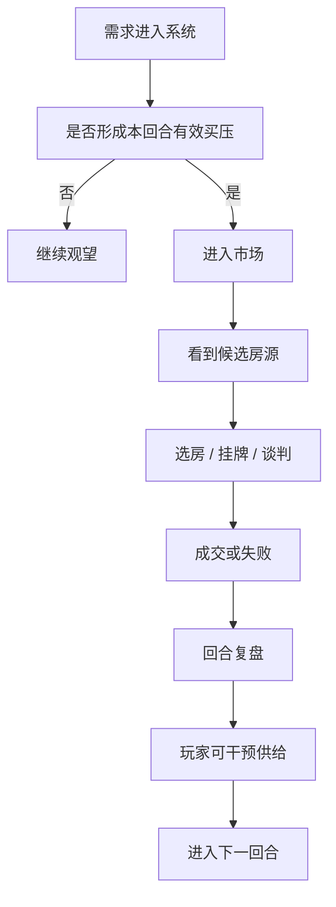
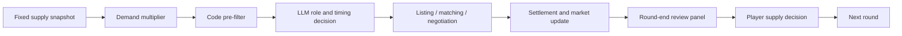

# AtlasMarketEngine

> A reproducible housing market simulation engine with fixed supply snapshots, demand-side scaling, real negotiation loops, round-end intervention controls, and public clone verification.

---

## First 3 Entry Points

If this is your first time opening the repository, start here:

1. Read the project overview in this page: `README.md`
2. Run the smallest clone verification:
   - `python scripts/public_smoke_test.py --rounds 1 --agent-count 8 --seed 42`
3. Open the public release map:
   - `docs/发布目录索引.md`

If you want the web interface immediately:

- Read `START_WEBSITE.md`
- Then run:
  - `powershell -ExecutionPolicy Bypass -File .\scripts\start_web_ui.ps1 -Mock`

---

## 中文说明

### 第一次访问仓库，先看这 3 个入口

如果你是第一次打开这个仓库，最先看这 3 个入口就够了：

1. `README.md`
   - 先知道这个项目是什么、为什么存在、已经能做什么
2. `scripts/public_smoke_test.py`
   - 先验证 clone 以后能不能跑起来
3. `docs/发布目录索引.md`
   - 再决定你要看通俗总结、发布说明、证据索引，还是操作手册

如果你想直接看网页界面，再走这一条：

- `START_WEBSITE.md`
- 然后执行：
  - `powershell -ExecutionPolicy Bypass -File .\scripts\start_web_ui.ps1 -Mock`

### 这个项目是什么

`AtlasMarketEngine` 是一个可运行、可复现、可解释的住房市场推演系统。

它不是只生成几条随机成交记录，而是把一个完整市场周期里的关键动作串起来：

1. 居民财务变化
2. 谁在这一轮真正进场
3. 卖家如何挂牌、如何调价
4. 买家看到什么、怎么选房、怎么谈价
5. 哪些交易真的成交，哪些失败
6. 一轮结束后，玩家是否要补供、减供、强制挂牌

这里统一使用“回合（Round）”而不是“自然月”。

原因是：系统里的 1 个回合包含一整轮市场结算、挂牌、看房、谈判、成交和归档流程，更接近“完整市场周期”，而不是现实日历月。

### 这个项目为什么存在

这个项目想回答的不是“房价会不会涨”这么单一的问题，而是：

- 固定供给底座下，市场能否自然跑起来
- 热度到底是真的竞争，还是只是看起来热
- 为什么后半段容易出现“有人想买，但没房可买”
- 玩家在回合末补供、减供、强制挂牌，到底能改变什么
- 不同供给结构、不同需求强度、不同冲击条件下，市场形状会怎么变化

### 这个项目现在能做什么

- 支持固定供应盘启动
  - 梭子型样本
  - 金字塔型样本
- 支持需求倍率控制
  - `0.10x - 2.00x`
- 自动保证两件事
  - 每类买家画像不会被压到消失
  - 每类供应画像仍有对应买家覆盖
- 支持真实模型驱动的买卖选择与谈判
- 支持回合末人工干预面板
  - 定向增供
  - 自动补供
  - 全量补充
  - 减供
  - 强制挂牌
- 支持 CLI、Web、数据库、报告、checkpoint 和断点续跑

### 核心机制


#### 1. 假热与真竞争分离

- 只是曝光高，不会自动抬价
- 只有出现真实多人竞争时，才会进入更强竞价和拍卖升级

#### 2. 激活结构拆分

系统不再把“长期有需求”和“本回合真的形成买压”混成一团，而是分成：

- 这回合该不该进场
- 如果进场，是立即买、立即卖、先卖后买，还是继续观望
- 进场以后，看见什么、怎么处理、何时行动

#### 3. `smart / normal` 只做行为修饰

生命周期和时点角色是主驱动，`smart / normal` 只修饰：

- 信息可见性
- 信息处理方式
- 行动时点
- 行为稳定性

#### 4. 回合末人工干预

系统会在市场明显变薄时暂停，让玩家基于复盘做供给决策，而不是默认全自动补货。

### 运行结果说明

当前公开仓只保留“衍生证据”，不公开内部原始运行数据库和完整原始日志包。

最关键的公开结论是：

- 不加外部调节，市场也能完整跑完 6 回合
- 加入供给调节后，总成交不一定更高，但后半段“有买家却没房可买”的情况会明显减少
- `seller_market` 的卖方强势是真实发生的，但主要集中在局部热点房源上
- 即使 `seller_market` 更偏卖方，平均总成交价也不一定更高，因为成交结构会下沉到更多低总价主流盘

卖方市场这条最容易被误解，所以我们单独保留了证据附录：

- `/docs/卖方市场局部竞价证据_20260418.md`

里面写清楚了：

- 证据来自哪个数据库
- 用到哪几张表
- 哪几套房发生了多人竞价
- 原挂牌价是多少
- 最终成交价是多少
- 几个人参与了竞价

### 性能与可运行性

系统采用“代码预筛选 + LLM 精准决策”的漏斗式结构，避免把所有人都直接丢给模型。

粗略流程是：

1. 代码先做大规模预筛
2. 模型只判断更小范围候选人本回合角色
3. 只有真正激活的人，才进入选房、挂牌和谈判

这让系统能把调用量控制在可接受范围，而不是每回合对所有人逐个问模型。

公开仓同时内置了 clone 可运行自检：

```bash
pip install -r requirements.txt
python scripts/public_smoke_test.py --rounds 1 --agent-count 8 --seed 42
```

这条 smoke 的目标不是验证研究结论，而是验证：

- 仓库能启动
- 能跑完至少 1 回合
- 能写数据库
- 能写报告

### 图形化理解



### 可能应用场景

- 房地产市场结构研究
- 住房政策和供给策略讨论
- 交互式演示和教学
- 多主体谈判与市场机制实验
- LLM 在社会模拟中的边界和解释性研究

### 公开仓发布政策

本仓采用 **只公开衍生证据（Derived Evidence Only）** 的发布政策：

- 不公开内部原始运行数据库
- 不公开完整原始日志包
- 不公开原始实验大包
- 只公开：
  - 汇总结果
  - 通俗总结
  - 说明文档
  - 操作手册
  - 讲解材料
  - 关键样例证据
  - clone 后最小可运行自检

### 建议阅读顺序

1. `/docs/中国住房市场推演发布收口摘要_20260418_通俗版.md`
2. `/docs/发布说明_20260418.md`
3. `/docs/发布证据包索引_20260418.md`
4. `/docs/卖方市场局部竞价证据_20260418.md`
5. `/docs/发布操作手册_20260418.md`

### 关于部分文档里的内部来源路径

部分详细证据文档仍会保留原始内部取证路径，用来说明这些结论最初来自哪条内部样本。

这些路径应理解为：

- 来源追溯信息
- 不是要求你在公开仓本地也一定存在同名目录

公开仓真正可用的入口，应优先看：

- `README.md`
- `START_WEBSITE.md`
- `docs/发布目录索引.md`
- `scripts/public_smoke_test.py`

---

## English

### First-time visitor: start with these 3 entry points

If this is your first time opening the repo, these are the three most useful starting points:

1. `README.md`
   - understand what the project is, why it exists, and what it currently supports
2. `scripts/public_smoke_test.py`
   - verify that a fresh clone can actually run
3. `docs/发布目录索引.md`
   - choose whether you want the plain-language summary, release notes, evidence index, or operating guide

If you want the web UI first, use:

- `START_WEBSITE.md`
- then run:
  - `powershell -ExecutionPolicy Bypass -File .\scripts\start_web_ui.ps1 -Mock`

### What this project is

`AtlasMarketEngine` is a reproducible and interpretable housing market simulation engine.

It does not just print random transactions. It models an entire market cycle:

1. household finance updates
2. who actually enters the market in this round
3. listing and repricing behavior
4. buyer visibility, property selection, and negotiation
5. which transactions close and which fail
6. whether the player injects supply, cuts supply, or forces listings at round end

We use the word **Round** instead of **Month** in public-facing materials.

That is intentional: one round in this project represents a full market cycle, not a real calendar month.

### Why this project exists

This engine is built to answer questions like:

- Can a housing market keep moving under a fixed supply base?
- Is observed heat real competition, or only superficial attention?
- Why do late rounds often become thinner even when buyers still exist?
- What does round-end supply intervention actually change?
- How does market shape change under different supply structures, demand pressure, or shocks?

### What it currently supports

- Fixed supply startup packs
  - spindle-shaped inventories
  - pyramid-shaped inventories
- Demand multiplier control
  - `0.10x - 2.00x`
- Automatic coverage guarantees
  - no buyer persona bucket disappears
  - every supply bucket still has matching buyer coverage
- LLM-driven decisions for intent, property choice, and negotiation
- Round-end intervention panel
  - targeted supply injection
  - automatic supply supplement
  - full replenishment
  - supply cut
  - forced listing
- CLI, Web, database output, reports, checkpoints, and resume

### Core mechanics



### Key findings

- The market can complete a 6-round run even without external intervention.
- Supply intervention does not necessarily maximize total transaction count.
- Its main value is reducing late-round mismatch: buyers still exist, but fewer of them end up with “no suitable active listing”.
- In `seller_market`, local bidding pressure is real, but concentrated in hotspot properties rather than uniformly raising every price.
- The average transaction price may stay below expectations even in a seller-leaning market because the sales mix can shift downward into more mainstream, lower-priced inventory.

### Performance and reproducibility

The engine uses a funnel:

1. code pre-filters large candidate pools
2. LLMs evaluate role and timing on a much smaller set
3. only activated participants enter full listing, matching, and negotiation loops

This keeps the system far more efficient than naively sending every agent into the LLM pipeline every round.

Public clone verification:

```bash
pip install -r requirements.txt
python scripts/public_smoke_test.py --rounds 1 --agent-count 8 --seed 42
```

This smoke test answers a practical question:

> Can a fresh clone boot, run, write a database, and complete a minimal round?

It is not meant to prove research-grade market realism by itself.

### Public release policy

This repository follows a **Derived Evidence Only** policy:

- no raw internal run databases
- no full raw log bundles
- no full private experiment packs
- only:
  - summaries
  - public-facing evidence notes
  - release docs
  - operation manual
  - presentation materials
  - selected evidence samples
  - runnable public smoke verification

### Recommended reading order

1. `/docs/中国住房市场推演发布收口摘要_20260418_通俗版.md`
2. `/docs/发布说明_20260418.md`
3. `/docs/发布证据包索引_20260418.md`
4. `/docs/卖方市场局部竞价证据_20260418.md`
5. `/docs/发布操作手册_20260418.md`

### About internal provenance paths in some evidence notes

Some detailed evidence notes still preserve original internal source paths.

Those paths should be interpreted as:

- provenance references
- not a requirement that the same internal directories exist in your public clone

For a fresh public user, the practical entry points are:

- `README.md`
- `START_WEBSITE.md`
- `docs/发布目录索引.md`
- `scripts/public_smoke_test.py`

---

## Quick Start

### CLI

```bash
python real_estate_demo_v2_1.py
```

### Web

```bash
python api_server.py
```

Then open the local web entry described in:

- `/START_WEBSITE.md`

### Public smoke

```bash
python scripts/public_smoke_test.py --rounds 1 --agent-count 8 --seed 42
```

---

## Repository Layout

- `/config` configuration, supply snapshots, persona background library
- `/services` core market and transaction services
- `/scripts` smoke runs, release runs, analysis and maintenance tooling
- `/tests` public and release-facing regression tests
- `/web` web UI
- `/docs` release docs, manual, evidence notes, PPT materials
- `/evidence` public summaries only

---

## Important note on `month/months`

If you still see `month` or `months` in some internal code, database fields, or compatibility outputs, interpret them as **legacy-compatible internal names**, not as a claim that the simulation round equals a real calendar month.
