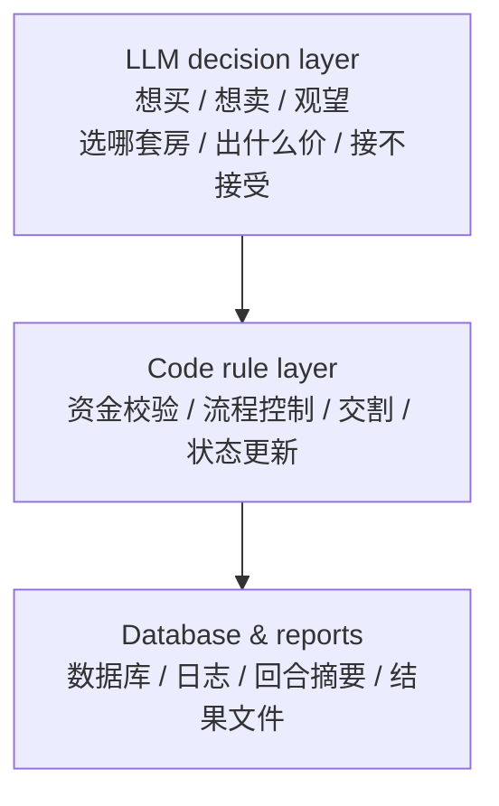
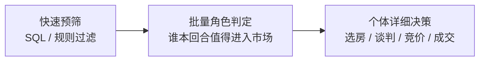
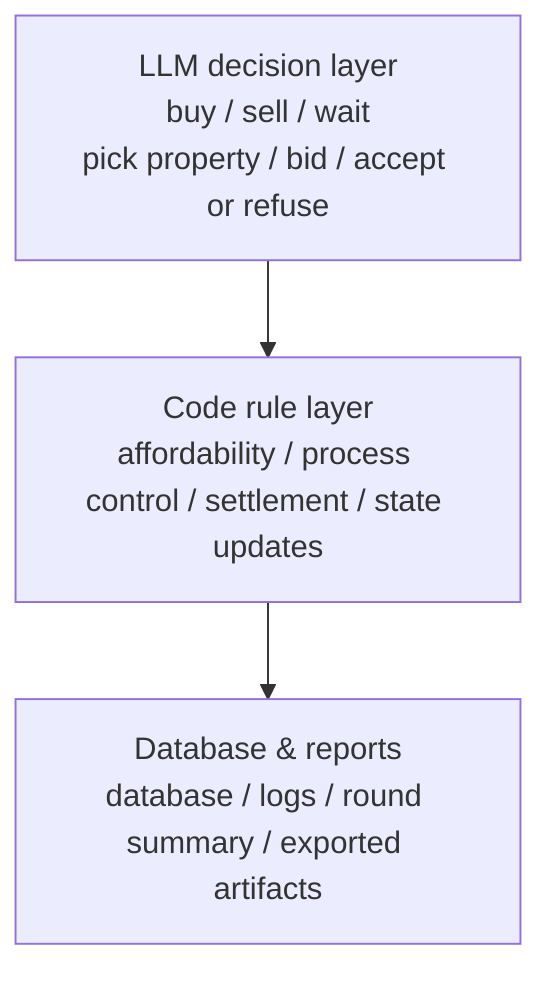
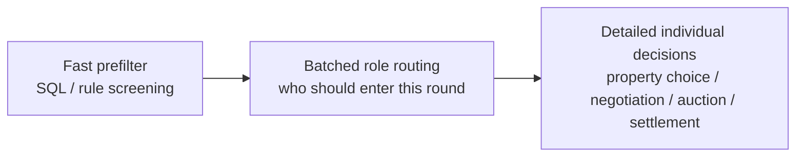

# AtlasMarketEngine

**A public research release for interpretable housing-market simulation**

[中文](#中文说明) | [English](#english)

AtlasMarketEngine is a public-facing research engine for housing-market simulation. It is built to answer a practical question:

**Can we reproduce understandable market states, explain why they happened, and let a human operator intervene without turning the system into a black box?**

This repository focuses on that release goal. It is not the full internal commercial stack, and it is not a generic “AI real estate demo.” It is a runnable research release with a clear transaction chain, visible assumptions, and reproducible entrypoints.


---

## 中文说明

### 这个项目是什么

AtlasMarketEngine 是一个住房市场推演引擎。

它的目标不是用一堆随机参数“编一个故事”，而是把下面几件事放到同一条可复查链上：

1. 谁在进场，谁在观望
2. 买家看到了什么房子，为什么选它
3. 卖家如何挂牌、调价、接受或拒绝
4. 谈判、出价、多人竞价、成交和失败是怎么发生的
5. 当市场后半段开始变薄时，系统和玩家分别能做什么

一句话说，它是一个：

**可运行、可解释、可干预、可复查的住房市场推演系统。**

### 为什么要做这个项目

现实中的住房市场很难只用一个数字讲清楚。

同样是“卖方市场”，可能会出现两种完全不同的形状：

1. 热点房源真的被多人竞价抬高
2. 平均总价没有明显上涨，因为成交结构下沉到了更多低总价主流盘

同样是“成交变少”，也可能是三种完全不同的原因：

1. 自然出清，流动性好的房子先卖完了
2. 需求没有消失，但对口在售房变少了
3. 系统把“被很多人看见”误判成“真的有人抢”

这个项目就是为了解开这些混在一起的因素，让研究者、产品经理、金融从业者或政策讨论者，可以更具体地看市场链条。

### 它解决什么问题

这个项目当前重点解决四类问题：

1. **假热和真竞争的区分**
   - 不是“看的人多”就等于“抢的人多”
2. **买卖双方决策链的可解释性**
   - 进场、选房、谈判、失败都有上下文
3. **固定供给下的后半段市场形状**
   - 为什么会变薄，哪里会先断，哪些桶位还在支撑成交
4. **人类可干预的市场实验**
   - 不是把系统全自动放养，而是在回合末给出可解释面板，让人决定是否补供、减供或强制挂牌

### 项目机制怎么理解

#### 1. LLM 负责“想做什么”，代码负责“能不能做”



这里最重要的边界是：

1. LLM 决定意愿和选择
2. 代码只做约束、验证和落盘

也就是说，代码不会偷偷替买家决定“你这个月必须买房”，也不会偷偷替卖家决定“你必须卖”。

#### 2. 性能为什么能撑住

系统不是让 LLM 对每个人、每套房、每一步都全量思考。

它走的是一个漏斗式流程：



这样做的好处是：

1. 大量不需要进场的人不会浪费模型调用
2. 真正需要精细判断的地方，LLM 才会深入参与
3. 运行速度、成本和解释性三者能平衡

### 当前公开版重点保留了哪些机制

1. 共享交易主链
2. 买方 / 卖方 / 平衡市场三类方向测试
3. 持续状态，不是每回合从零开始
4. 多人竞价和被挤出逻辑
5. 派生证据输出
6. Scholar CLI 入口
7. 本地 smoke test 和 GitHub Actions 自检链

### 当前公开版没有保留什么

1. 更完整的内部原始证据库
2. 更深的治理参数包
3. 更复杂的商业化行业适配层
4. 全部内部研究支线材料

所以这不是“完整商业交付版”，而是：

**一个适合公开说明、公开运行、公开建立可信度的 Research Release。**

### 图形理解：它大概长什么样

#### 验证概览图


#### CLI 展示图


### 当前已经看到的结果形状

基于当前公开版保留的证据，可以先读出几条稳定结论：

1. 系统可以稳定拉开三类市场形状：
   - 平衡市场
   - 买方市场
   - 卖方市场
2. 卖方市场并不等于“所有房子一起暴涨”
   - 更真实的形状是：局部热点房源真的被竞价抬高
   - 但整条样本的平均总成交价，可能因为低总价主流盘成交更多，而没有同步拉高
3. 后半段成交减少，不一定代表系统失真
   - 也可能是固定供给市场自然出清后的薄市化
4. 供给干预的价值，不只是堆高总成交
   - 更重要的是缓和“有人想买，但没对口在售房”的后半段错位

### 运行结果应该怎么看

当前公开版建议同时看三类结果：

1. **成交量**
   - 看市场有没有真正跑起来
2. **成交价相对挂牌价**
   - 看议价位置更偏向谁
3. **竞价失败和找不到房的次数**
   - 看市场是因为太冷、太挤，还是结构错位

### 运行性能应该怎么理解

这个项目的性能，不应该只看“跑一轮花了几分钟”，还要看“为什么能在可解释前提下跑完”。

可以把当前公开版的性能理解成三层：

1. **本地最小 smoke**
   - 目标：验证克隆后能不能跑
   - 方法：强制 mock 模式，1 回合，小样本
2. **演示彩排**
   - 目标：验证真实模型下，入口和结果链能不能对外展示
   - 真实样例：`3` 回合演示样本约 `11.2` 分钟跑完
3. **正式长测**
   - 目标：比较不同市场方向和结构敏感性
   - 用来证明机制是否稳定，不是给第一次克隆的人当入门用例

### 别人下载后怎么确认“真的能跑”

这是现在最重要的工程问题之一。

当前推荐两种方法：

#### 方法 A：本地最小自检

```bash
pip install -r requirements.txt
python scripts/public_smoke_test.py --rounds 1 --agent-count 8 --seed 42
```

这条命令会：

1. 强制使用 mock 模式，不依赖真实模型 API
2. 跑一个最小样本
3. 自动生成：
   - `public_smoke_report.json`
   - `public_smoke_report.md`

它回答的不是“市场机制够不够真实”，而是：

**这个仓库被别人 clone 下来以后，能不能启动、能不能跑一轮、能不能写数据库和结果文件。**

#### 方法 B：看 GitHub Actions

这个仓库已经加入 `public-smoke` workflow。

只要推送到 GitHub，Actions 就会自动做：

1. 安装依赖
2. 运行最小 smoke
3. 上传 smoke 报告 artifact

也就是说，别人不一定要先相信 README，可以先看自动化检查是不是绿的。

### 推荐先读什么

如果你只有 5 分钟，按这个顺序：

1. [公开证据摘要](./evidence/market_validation_summary_public.md)
2. [发布目录索引](./docs/发布目录索引.md)
3. [Scholar CLI 复现实验说明](./docs/Scholar_CLI_复现实验说明_20260412.md)
4. [主入口](./real_estate_demo_v2_1.py)

### 可能的应用场景

1. 住房市场机制研究
2. 金融机构的按揭与供需错位讨论
3. 城市住房产品结构比较
4. 房地产产品经理或研究员的演示样机
5. 需要“能讲清楚为什么这样成交”的 AI 经济模拟演示

### 公开版边界

这个仓库是公开研究版，不是完整商业版。

所以它更适合回答：

1. 这个系统到底在做什么
2. 它为什么值得继续看
3. 它能不能跑
4. 它能不能解释市场状态

而不是直接回答：

1. 现实世界未来几个月一定会怎样
2. 某个城市的真实价格预测是什么

---

## English

### What this project is

AtlasMarketEngine is a housing-market simulation engine.

It is not trying to produce a “cool AI story” with random parameters. Instead, it keeps the full chain visible:

1. who enters the market and who stays out
2. what buyers see and why they choose a property
3. how sellers list, reprice, accept, or refuse
4. how negotiation, outbids, and transactions actually happen
5. what humans can do when the late-stage market becomes thin

In one sentence:

**It is a runnable, explainable, intervenable, and inspectable housing-market simulation system.**

### Why this project exists

Real housing markets are hard to explain with one number.

A “seller market” can mean very different things:

1. some hotspot properties are genuinely pushed up by multi-bid competition
2. the overall average transaction price does not rise much because more low-priced mainstream units are being sold

Likewise, “fewer transactions” can come from very different reasons:

1. natural inventory depletion
2. buyers still exist, but matching active listings are missing
3. the system mistakes visibility heat for real competition

This project exists to separate those forces and make them discussable.

### What problem it solves

The current public release focuses on four problems:

1. **Separating fake heat from real competition**
2. **Making buyer and seller decisions explainable**
3. **Understanding late-stage market thinning under fixed supply**
4. **Allowing human intervention without turning the system into a black box**

### How to think about the mechanism

#### 1. The LLM decides intent; code enforces rules



The key boundary is:

1. the LLM chooses intent and behavior
2. code validates, constrains, and records

#### 2. Why the performance is manageable

The system does not ask the model to think deeply about every agent at every step.

It uses a funnel:



This is what keeps the release practical:

1. non-participants do not consume expensive calls
2. detailed LLM reasoning is reserved for actual market actors
3. speed, cost, and interpretability stay in balance

### What this public release keeps

1. the shared transaction chain
2. balanced / buyer / seller market direction tests
3. persistent state across rounds
4. multi-bid and outbid logic
5. derived public evidence
6. the Scholar CLI entrypoint
7. a local smoke test and GitHub Actions verification path

### What this public release does not keep

1. the full internal raw evidence archive
2. deeper governance parameter packs
3. richer commercial scenario layers
4. every internal research branch

So this is not the full commercial product. It is a:

**public research release that is clear enough to explain and solid enough to run.**

### Visual overview

#### Validation overview


#### CLI overview


### What the current results already show

The public evidence supports several stable conclusions:

1. the engine can separate balanced, buyer, and seller market shapes
2. a seller market does **not** necessarily mean every property goes up together
3. lower late-stage volume does **not** automatically mean the model is broken
4. supply-side intervention is valuable mainly because it reduces late-stage mismatch, not because it simply maximizes transaction count

### How to read the results

The most useful output signals are:

1. **transaction volume**
2. **transaction-to-list ratio**
3. **outbid counts and “no active listing” counts**

That combination helps distinguish:

1. a cold market
2. a crowded seller-leaning market
3. a structurally mismatched market

### How to think about runtime performance

Do not read performance only as “how many minutes does one run take.”

There are three practical layers:

1. **local clone verification**
   - goal: prove the repo boots after clone
   - method: mock mode, one round, tiny sample
2. **demo rehearsal**
   - goal: prove the public path works with live models
   - real example: a 3-round demo run completed in about `11.2` minutes
3. **release comparison runs**
   - goal: validate market-shape stability, not provide first-run onboarding

### How to test whether a fresh clone actually works

This matters a lot for a public repository.

There are two recommended methods:

#### Method A: local smoke test

```bash
pip install -r requirements.txt
python scripts/public_smoke_test.py --rounds 1 --agent-count 8 --seed 42
```

This command:

1. forces mock mode
2. runs a minimal sample
3. writes:
   - `public_smoke_report.json`
   - `public_smoke_report.md`

It is not a realism check. It answers a simpler question:

**Can someone clone this repo, boot it, run one round, and get a database plus output files?**

#### Method B: GitHub Actions

This repo ships with a `public-smoke` workflow.

On push or pull request, it will:

1. install dependencies
2. run the same minimal smoke test
3. upload the smoke report artifact

So people do not need to trust the README blindly. They can inspect the automated check status.

### What to read first

If you only have five minutes:

1. [Public evidence summary](./evidence/market_validation_summary_public.md)
2. [Repository map](./docs/发布目录索引.md)
3. [Scholar CLI reproduction guide](./docs/Scholar_CLI_复现实验说明_20260412.md)
4. [Main entrypoint](./real_estate_demo_v2_1.py)

### Possible application scenarios

1. housing-market mechanism research
2. mortgage and supply-mismatch discussion in finance
3. comparing supply structures in urban housing products
4. explainable real-estate simulation demos
5. AI economy demos where transaction logic must be inspectable

### Release boundary

This is a public research release, not a full commercial product.

It is best used to answer:

1. what the system does
2. why it matters
3. whether it runs
4. whether it can explain market states

It is **not** meant to claim:

1. direct real-world price prediction
2. city-specific short-term forecasting

---

## Quick start

```bash
pip install -r requirements.txt
python real_estate_demo_v2_1.py
```

Main entrypoint:

- [real_estate_demo_v2_1.py](./real_estate_demo_v2_1.py)

Public clone verification:

```bash
python scripts/public_smoke_test.py --rounds 1 --agent-count 8 --seed 42
```

---

## Repository layout

- [docs/发布目录索引.md](./docs/发布目录索引.md): public repository map
- [docs/Scholar_CLI_复现实验说明_20260412.md](./docs/Scholar_CLI_复现实验说明_20260412.md): how to reproduce public-facing runs
- [evidence/market_validation_summary_public.md](./evidence/market_validation_summary_public.md): current public evidence summary
- [assets/](./assets): visuals and release graphics
- [config/](./config): public configuration set
- [services/](./services): service layer
- [scripts/](./scripts): orchestration and verification scripts

---

## License and attribution

This repository includes third-party notices and attribution files:

- [LICENSE](./LICENSE)
- [NOTICE](./NOTICE)
- [ATTRIBUTION.md](./ATTRIBUTION.md)
